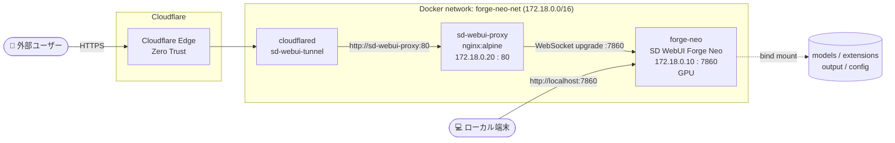

# sd-webui-forge-neo

**Stable Diffusion WebUI Forge Neo** を GPU サーバーですぐ動かすための Docker Compose 一式です。マルチステージビルドで最新の推論高速化カーネルをソースからビルドし、nginx + Cloudflare Tunnel で安全に外部公開するところまでを1つのリポジトリにまとめています。

<p align="left">
  
  
  
  
  
</p>

---

## これは何か

このリポジトリは **Stable Diffusion WebUI 本体の実装ではありません**。

[AUTOMATIC1111/stable-diffusion-webui](https://github.com/AUTOMATIC1111/stable-diffusion-webui) → [lllyasviel/stable-diffusion-webui-forge](https://github.com/lllyasviel/stable-diffusion-webui-forge) → [Haoming02/sd-webui-forge-classic](https://github.com/Haoming02/sd-webui-forge-classic)（`neo` ブランチ）と続く系譜の中で、現在最も活発にメンテナンスされている派生版を土台として、

- GPU 環境向けのマルチステージ Dockerfile
- 推論高速化ライブラリ群のソースビルド
- nginx + Cloudflare Tunnel による安全な外部公開構成
- モデル・設定・出力をコンテナ外に永続化する Compose 定義

を設計・実装した、**デプロイ / インフラ層**のリポジトリです。WebUI 自体の機能や品質は upstream プロジェクトに依存します。

---

## アーキテクチャ



- **ローカルアクセス**: `forge-neo` コンテナの `7860` を直接ホストへ公開
- **外部アクセス**: Cloudflare Tunnel → nginx（WebSocket終端・ポート秘匿）→ `forge-neo` の経路のみで、インバウンドポートは一切開放しない
- **永続化**: `models/` `extensions/` `output/` `config/` をすべて bind mount し、コンテナ自体はいつでも作り直せる使い捨て構成にしている

---

## 主な特徴

**マルチステージビルドで実行イメージを最小化**
`builder` ステージ（CUDA 13.0 devel）で各種カーネルを wheel 化し、`minimal` ステージ（CUDA 13.0 runtime）には完成した wheel だけを `--mount=type=bind` でコピーする。ビルドツールチェイン一式を実行イメージに残さない構成。

**推論高速化スタックを自前ビルド**
公式パッケージがまだ対応していない組み合わせ（CUDA 13.0 / PyTorch 2.13 / Python 3.13）向けに、以下をソースからビルドしている。

| ライブラリ | 役割 |
|---|---|
| SageAttention / SpargeAttn（[thu-ml](https://github.com/thu-ml)） | 量子化Attention |
| FlashAttention v2.8 | メモリ効率の良いAttention実装 |
| Nunchaku（SVDQuant） | 4bit量子化による省VRAM推論エンジン |
| onnxruntime-gpu（CUDA13対応nightly） | ONNX推論の高速化 |

**ビルド時プリインストール／実行時オプトインの分離**
Dockerfile 内では `webui.sh --exit`（ドライラン）を使い `--bnb --flash --nunchaku --onnxruntime-gpu` を含めて一度すべてインストールしておき、`entrypoint.sh` 側ではデフォルトで一部のバックエンドのみを有効化している。コメントアウトを外すだけで切り替えられ、リビルドは不要。

**最小権限設計**
非rootユーザー（`ubuntu`）で実行し、`cap_drop: ALL` に必要最小限の `cap_add` のみを付与。Docker Swarm の配置制約（`node.labels.iface != extern`）にも対応し、外部インターフェースを持つノードへの配置を避けられる。

**イメージサイズの最適化**
`__pycache__` / `*.pyc` / テスト・ドキュメントディレクトリの削除、`.so` の `strip`、各種キャッシュのクリーンアップをビルドの最後にまとめて実行。

---

## 技術スタック

| 分類 | 技術 |
|---|---|
| コンテナ | Docker / Docker Compose（Swarm配置制約にも対応） |
| GPU基盤 | NVIDIA CUDA 13.0 / cuDNN |
| ML基盤 | PyTorch 2.13, Python 3.13 |
| パッケージ管理 | [uv](https://github.com/astral-sh/uv)（Astral） |
| 推論高速化 | SageAttention, SpargeAttn, FlashAttention, xFormers, Nunchaku, onnxruntime-gpu |
| WebUI | [sd-webui-forge-classic](https://github.com/Haoming02/sd-webui-forge-classic)（`neo` branch） |
| リバースプロキシ | nginx（WebSocket対応） |
| 外部公開 | Cloudflare Tunnel |

---

## ディレクトリ構成

```text
.
├── .env.example              # 環境変数テンプレート
├── compose.yml                # forge-neo / nginx / cloudflared の3コンテナ構成
├── Dockerfile                  # マルチステージビルド定義
├── entrypoint.sh               # 起動スクリプト（COMMANDLINE_ARGS・venv確認）
├── config/
│   ├── config.json             # WebUI基本設定（永続化）
│   ├── ui-config.json          # Gradio UIコンポーネント状態（永続化）
│   └── config_states/          # 拡張機能の状態スナップショット
├── nginx/
│   └── sd-webui.conf           # リバースプロキシ設定
├── extensions/                  # カスタム拡張（bind mount）
├── models/                     # モデル格納（bind mount, リポジトリには含まれない）
│   ├── Stable-diffusion/
│   ├── Lora/
│   ├── VAE/
│   ├── ControlNet/
│   ├── ControlNetPreprocessor/
│   ├── ESRGAN/
│   ├── diffusers/
│   └── text_encoder/
└── output/                      # 生成画像の出力先（bind mount）
```

---

## セットアップ

### 前提条件

- NVIDIA GPU + ドライバ、[NVIDIA Container Toolkit](https://github.com/NVIDIA/nvidia-container-toolkit)
- Docker Engine 24+ / Docker Compose v2
- （外部公開する場合のみ）Cloudflareアカウントと Tunnel トークン
- 初回ビルドは各種カーネルをソースからコンパイルするため、十分なCPU・メモリ・ディスク容量と数十分単位のビルド時間

### 起動手順

```bash
git clone <このリポジトリのURL>
cd sd-webui-forge-neo

cp .env.example .env
```

`.env` を編集する。

| 変数 | 内容 |
|---|---|
| `TORCH_CUDA_ARCH_LIST` | GPU世代に合わせて設定（Ampere: `8.6` / Ada Lovelace: `8.9` / Blackwell: `12.0`） |
| `MAX_JOBS` | ビルド時の並列ジョブ数 |
| `UV_CONCURRENT_DOWNLOADS` / `UV_CONCURRENT_INSTALLS` | uv の並列ダウンロード/インストール数 |
| `TUNNEL_TOKEN` | Cloudflare Tunnel を使う場合のみ設定 |

```bash
docker compose up -d --build
```

起動後、ローカルからは `http://localhost:7860` でアクセスできる。

### モデルの配置

`models/` 配下の各サブディレクトリ（`Stable-diffusion` / `Lora` / `VAE` / `ControlNet` / `ControlNetPreprocessor` / `ESRGAN` / `diffusers` / `text_encoder`）にファイルを配置する。bind mount のため、コンテナの再起動やリビルドは不要。モデルファイル自体はライセンス・容量の都合上このリポジトリには含まれない。

### 外部公開（Cloudflare Tunnel）

`cloudflared` コンテナは `TUNNEL_TOKEN` を使ったリモート管理トンネルとして動作する。公開ホスト名 → `http://sd-webui-proxy:80` へのルーティングは、ローカルの設定ファイルではなく [Cloudflare Zero Trust ダッシュボード](https://one.dash.cloudflare.com/) 側の Tunnel 設定で行う。

---

## セキュリティに関する注意

- 現状 nginx / Cloudflare Tunnel 層に認証機構はなく、公開ホスト名を知っていれば誰でもアクセスできる状態になる。実運用では次のいずれかを推奨する。
  - Tunnel のルートに **Cloudflare Access**（Zero Trust）でSSO/メール認証を追加する
  - `entrypoint.sh` の `COMMANDLINE_ARGS` に Forge/A1111系でおなじみの `--gradio-auth user:pass` を追加する
- `--enable-insecure-extension-access` を有効化しているため、信頼できない拡張機能はインストールしないこと。

---

## 既知の制限・今後の展望

- 単一GPU・単一ノード構成が前提で、マルチGPU分散推論には対応していない
- モデルファイルはリポジトリに含まれず、利用者側での配置が必要
- 認証はアプリ外（Cloudflare Access等）に委ねる設計になっている
- GitHub Actions などによるイメージビルドの自動化・公開は未整備

---

## クレジット

このデプロイ構成が利用させてもらっているプロジェクト。

- [AUTOMATIC1111/stable-diffusion-webui](https://github.com/AUTOMATIC1111/stable-diffusion-webui)
- [lllyasviel/stable-diffusion-webui-forge](https://github.com/lllyasviel/stable-diffusion-webui-forge)
- [Haoming02/sd-webui-forge-classic](https://github.com/Haoming02/sd-webui-forge-classic)（`neo` branch）
- [thu-ml/SageAttention](https://github.com/thu-ml/SageAttention) / [thu-ml/SpargeAttn](https://github.com/thu-ml/SpargeAttn)
- [Dao-AILab/flash-attention](https://github.com/Dao-AILab/flash-attention)（[mjun0812/flash-attention-prebuild-wheels](https://github.com/mjun0812/flash-attention-prebuild-wheels) のビルド済みwheelを利用）
- [nunchaku-tech/nunchaku](https://github.com/nunchaku-tech/nunchaku)
- [astral-sh/uv](https://github.com/astral-sh/uv)

## ライセンス

このリポジトリ自体（Dockerfile / compose.yml / nginx設定などのデプロイ構成一式）にはまだライセンスを設定していない。公開する際は用途に応じて `LICENSE` の追加を検討のこと。

ビルド時にクローンされる WebUI 本体（および遡って AUTOMATIC1111/stable-diffusion-webui）は **AGPL-3.0** である。AGPLはネットワーク経由の提供にもソース開示義務が及ぶため、改変した上で外部公開・運用する場合は留意すること。
